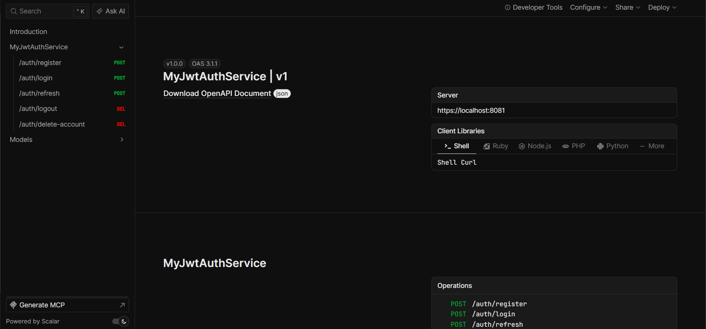

# This is a test jwt auth server

## It has no email confirmation, nothing like that. It's really simple



```json
{
  "openapi": "3.1.1",
  "info": {
    "title": "MyJwtAuthService | v1",
    "version": "1.0.0"
  },
  "servers": [
    {
      "url": "https://localhost:8081/"
    }
  ],
  "paths": {
    "/auth/register": {
      "post": {
        "tags": [
          "MyJwtAuthService"
        ],
        "requestBody": {
          "content": {
            "application/json": {
              "schema": {
                "$ref": "#/components/schemas/RegisterRequest"
              }
            }
          },
          "required": true
        },
        "responses": {
          "200": {
            "description": "OK"
          }
        }
      }
    },
    "/auth/login": {
      "post": {
        "tags": [
          "MyJwtAuthService"
        ],
        "requestBody": {
          "content": {
            "application/json": {
              "schema": {
                "$ref": "#/components/schemas/LoginRequest"
              }
            }
          },
          "required": true
        },
        "responses": {
          "200": {
            "description": "OK",
            "content": {
              "application/json": {
                "schema": {
                  "$ref": "#/components/schemas/AuthenticatedUserResponse"
                }
              }
            }
          }
        }
      }
    },
    "/auth/refresh": {
      "post": {
        "tags": [
          "MyJwtAuthService"
        ],
        "requestBody": {
          "content": {
            "application/json": {
              "schema": {
                "$ref": "#/components/schemas/RefreshRequest"
              }
            }
          },
          "required": true
        },
        "responses": {
          "200": {
            "description": "OK",
            "content": {
              "application/json": {
                "schema": {
                  "$ref": "#/components/schemas/AuthenticatedUserResponse"
                }
              }
            }
          }
        }
      }
    },
    "/auth/logout": {
      "delete": {
        "tags": [
          "MyJwtAuthService"
        ],
        "responses": {
          "204": {
            "description": "No Content"
          }
        }
      }
    },
    "/auth/delete-account": {
      "delete": {
        "tags": [
          "MyJwtAuthService"
        ],
        "responses": {
          "204": {
            "description": "No Content"
          }
        }
      }
    }
  },
  "components": {
    "schemas": {
      "AuthenticatedUserResponse": {
        "required": [
          "accessToken",
          "accessTokenExpirationTime",
          "refreshToken"
        ],
        "type": "object",
        "properties": {
          "accessToken": {
            "type": "string"
          },
          "accessTokenExpirationTime": {
            "type": "string",
            "format": "date-time"
          },
          "refreshToken": {
            "type": "string"
          }
        }
      },
      "LoginRequest": {
        "required": [
          "username",
          "password"
        ],
        "type": "object",
        "properties": {
          "username": {
            "type": "string"
          },
          "password": {
            "type": "string"
          }
        }
      },
      "RefreshRequest": {
        "required": [
          "refreshToken"
        ],
        "type": "object",
        "properties": {
          "refreshToken": {
            "type": "string"
          }
        }
      },
      "RegisterRequest": {
        "required": [
          "email",
          "username",
          "password",
          "confirmPassword"
        ],
        "type": "object",
        "properties": {
          "email": {
            "type": "string"
          },
          "username": {
            "type": "string"
          },
          "password": {
            "type": "string"
          },
          "confirmPassword": {
            "type": "string"
          }
        }
      }
    }
  },
  "tags": [
    {
      "name": "MyJwtAuthService"
    }
  ]
}
```