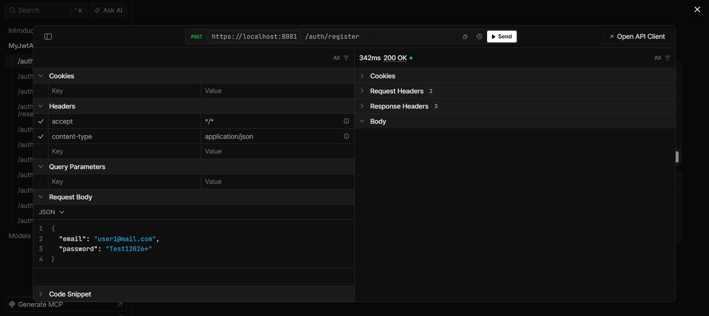
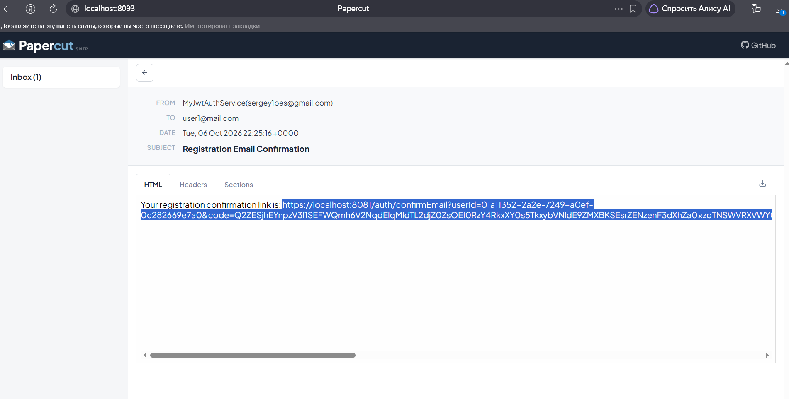
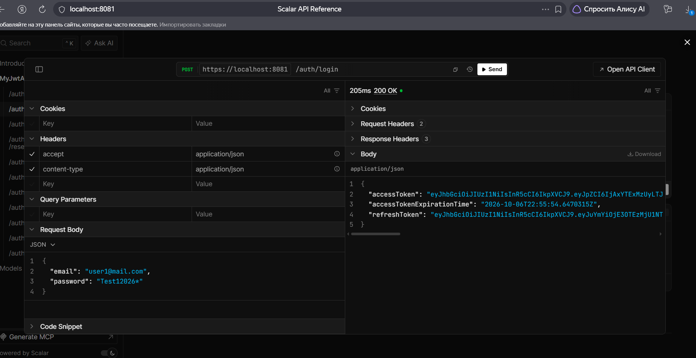
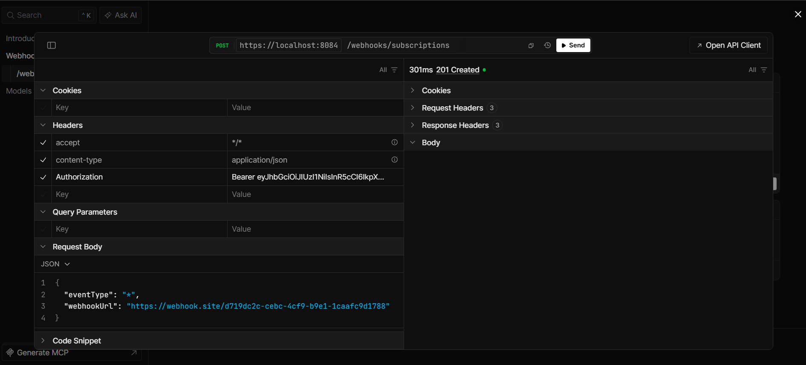
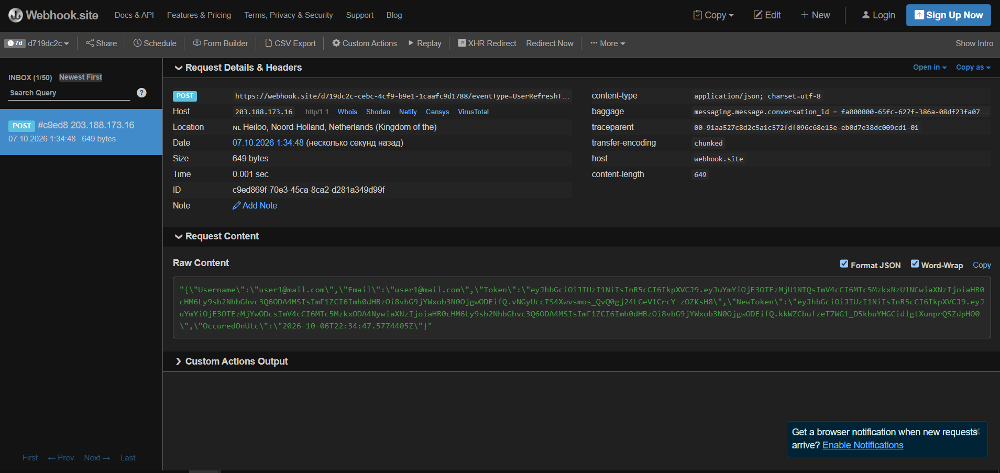

# Application Description

## This is a jwt authentication server with email confirmation. I added webhooks to it so that some user/app can subscribe to events of this server. To set it up:

### First we need to register in our auth server

### Confirm email:

### Login:

### Then we need to use that access token to set up a webhook subscription in the webhook server

### I used the webhook.site service. Now, when, for example, we refresh our tokens:

