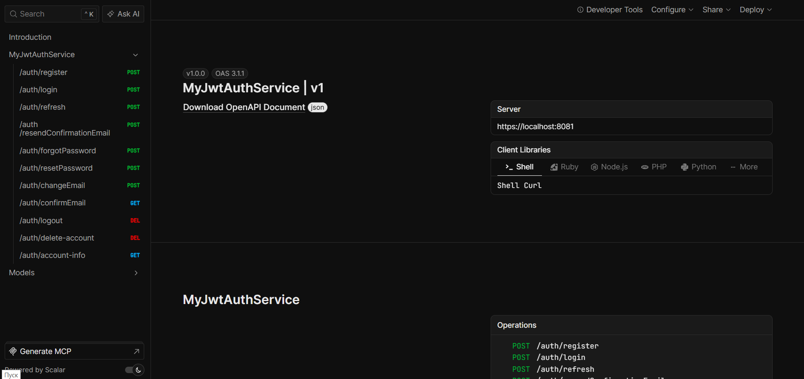
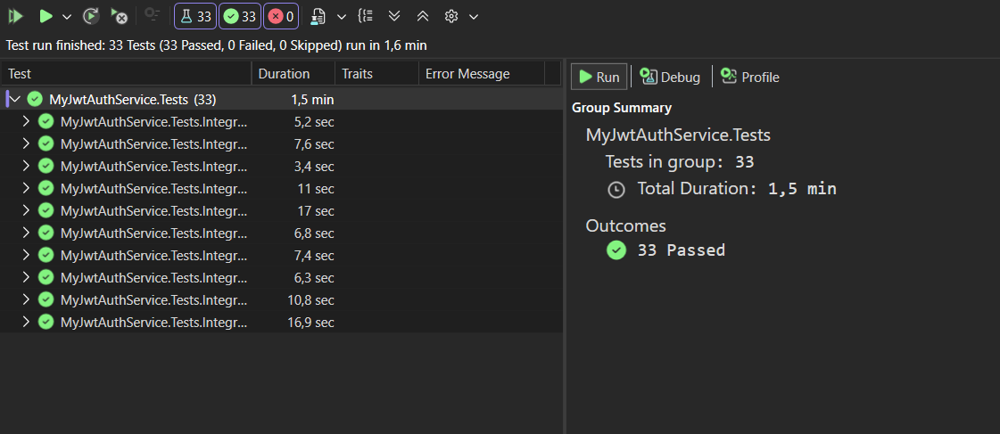

# Application Description

## This is an authentication server with email confirmation. It uses JWT. 

*The endpoins:*



*For testing I used XUnit with Testcontainers. To make tests as clean as possible, the containers are recreated for each test.*



```json
{
  "openapi": "3.1.1",
  "info": {
    "title": "MyJwtAuthService | v1",
    "version": "1.0.0"
  },
  "servers": [
    {
      "url": "https://localhost:8081/"
    }
  ],
  "paths": {
    "/auth/register": {
      "post": {
        "tags": [
          "MyJwtAuthService"
        ],
        "description": "Allows registration for users using email verification.",
        "operationId": "register",
        "requestBody": {
          "content": {
            "application/json": {
              "schema": {
                "$ref": "#/components/schemas/RegisterRequest"
              }
            }
          },
          "required": true
        },
        "responses": {
          "200": {
            "description": "OK"
          }
        }
      }
    },
    "/auth/login": {
      "post": {
        "tags": [
          "MyJwtAuthService"
        ],
        "description": "Allows users to sign in to their account by their Username and Password",
        "operationId": "login",
        "requestBody": {
          "content": {
            "application/json": {
              "schema": {
                "$ref": "#/components/schemas/LoginRequest"
              }
            }
          },
          "required": true
        },
        "responses": {
          "200": {
            "description": "OK",
            "content": {
              "application/json": {
                "schema": {
                  "$ref": "#/components/schemas/AuthenticatedUserResponse"
                }
              }
            }
          }
        }
      }
    },
    "/auth/refresh": {
      "post": {
        "tags": [
          "MyJwtAuthService"
        ],
        "description": "Allows users to get a new short-lived access token by their long-lived refresh token.",
        "operationId": "refresh",
        "requestBody": {
          "content": {
            "application/json": {
              "schema": {
                "$ref": "#/components/schemas/RefreshRequest"
              }
            }
          },
          "required": true
        },
        "responses": {
          "200": {
            "description": "OK",
            "content": {
              "application/json": {
                "schema": {
                  "$ref": "#/components/schemas/AuthenticatedUserResponse"
                }
              }
            }
          }
        }
      }
    },
    "/auth/resendConfirmationEmail": {
      "post": {
        "tags": [
          "MyJwtAuthService"
        ],
        "description": "To be able to sign in to a user's account, email confirmation is required. Such an email is sent during registration, but if it fails, you can always resend your confirmation email.",
        "operationId": "resendConfirmationEmail",
        "requestBody": {
          "content": {
            "application/json": {
              "schema": {
                "$ref": "#/components/schemas/ResendRequest"
              }
            }
          },
          "required": true
        },
        "responses": {
          "200": {
            "description": "OK"
          }
        }
      }
    },
    "/auth/forgotPassword": {
      "post": {
        "tags": [
          "MyJwtAuthService"
        ],
        "description": "Allows you to restore the access to your account. You get an email, in which you get a reset token. Then you need to pass that token to the reset password endpoint.",
        "operationId": "forgotPassword",
        "requestBody": {
          "content": {
            "application/json": {
              "schema": {
                "$ref": "#/components/schemas/ForgotPasswordRequest"
              }
            }
          },
          "required": true
        },
        "responses": {
          "200": {
            "description": "OK"
          }
        }
      }
    },
    "/auth/resetPassword": {
      "post": {
        "tags": [
          "MyJwtAuthService"
        ],
        "description": "Allows you to reset your password. You need to get a reset token ",
        "operationId": "resetPassword",
        "requestBody": {
          "content": {
            "application/json": {
              "schema": {
                "$ref": "#/components/schemas/ResetPasswordRequest"
              }
            }
          },
          "required": true
        },
        "responses": {
          "200": {
            "description": "OK"
          }
        }
      }
    },
    "/auth/changeEmail": {
      "post": {
        "tags": [
          "MyJwtAuthService"
        ],
        "description": "Allows users to change their email for a new one.",
        "operationId": "changeEmail",
        "requestBody": {
          "content": {
            "application/json": {
              "schema": {
                "$ref": "#/components/schemas/ChangeEmailRequest"
              }
            }
          },
          "required": true
        },
        "responses": {
          "200": {
            "description": "OK"
          }
        }
      }
    },
    "/auth/confirmEmail": {
      "get": {
        "tags": [
          "MyJwtAuthService"
        ],
        "description": "After recieving a confirmation email, you must follow the link which leads here. That way a user confirms their email address.",
        "operationId": "confirmEmail",
        "parameters": [
          {
            "name": "userId",
            "in": "query",
            "required": true,
            "schema": {
              "type": "string"
            }
          },
          {
            "name": "code",
            "in": "query",
            "required": true,
            "schema": {
              "type": "string"
            }
          },
          {
            "name": "changedEmail",
            "in": "query",
            "schema": {
              "type": "string"
            }
          }
        ],
        "responses": {
          "200": {
            "description": "OK"
          }
        }
      }
    },
    "/auth/logout": {
      "delete": {
        "tags": [
          "MyJwtAuthService"
        ],
        "description": "Allows users to log out of their account.",
        "operationId": "logout",
        "responses": {
          "204": {
            "description": "No Content"
          }
        }
      }
    },
    "/auth/delete-account": {
      "delete": {
        "tags": [
          "MyJwtAuthService"
        ],
        "description": "Allows users to delete their account if they want.",
        "operationId": "delete-account",
        "responses": {
          "204": {
            "description": "No Content"
          }
        }
      }
    },
    "/auth/account-info": {
      "get": {
        "tags": [
          "MyJwtAuthService"
        ],
        "description": "Allows users to get their account information",
        "operationId": "account-info",
        "responses": {
          "200": {
            "description": "OK",
            "content": {
              "application/json": {
                "schema": {
                  "$ref": "#/components/schemas/UserInfoResponse"
                }
              }
            }
          }
        }
      }
    }
  },
  "components": {
    "schemas": {
      "AuthenticatedUserResponse": {
        "required": [
          "accessToken",
          "accessTokenExpirationTime",
          "refreshToken"
        ],
        "type": "object",
        "properties": {
          "accessToken": {
            "type": "string"
          },
          "accessTokenExpirationTime": {
            "type": "string",
            "format": "date-time"
          },
          "refreshToken": {
            "type": "string"
          }
        }
      },
      "ChangeEmailRequest": {
        "required": [
          "newEmail"
        ],
        "type": "object",
        "properties": {
          "newEmail": {
            "type": "string"
          }
        }
      },
      "ForgotPasswordRequest": {
        "required": [
          "email"
        ],
        "type": "object",
        "properties": {
          "email": {
            "type": "string"
          }
        }
      },
      "LoginRequest": {
        "required": [
          "email",
          "password"
        ],
        "type": "object",
        "properties": {
          "email": {
            "type": "string"
          },
          "password": {
            "type": "string"
          }
        }
      },
      "RefreshRequest": {
        "required": [
          "refreshToken"
        ],
        "type": "object",
        "properties": {
          "refreshToken": {
            "type": "string"
          }
        }
      },
      "RegisterRequest": {
        "required": [
          "email",
          "password"
        ],
        "type": "object",
        "properties": {
          "email": {
            "type": "string"
          },
          "password": {
            "type": "string"
          }
        }
      },
      "ResendRequest": {
        "required": [
          "email"
        ],
        "type": "object",
        "properties": {
          "email": {
            "type": "string"
          }
        }
      },
      "ResetPasswordRequest": {
        "required": [
          "email",
          "newPassword",
          "resetCode"
        ],
        "type": "object",
        "properties": {
          "email": {
            "type": "string"
          },
          "newPassword": {
            "type": "string"
          },
          "resetCode": {
            "type": "string"
          }
        }
      },
      "UserInfoResponse": {
        "required": [
          "id",
          "username",
          "email",
          "emailConfirmed",
          "roles"
        ],
        "type": "object",
        "properties": {
          "id": {
            "type": "string",
            "format": "uuid"
          },
          "username": {
            "type": [
              "null",
              "string"
            ]
          },
          "email": {
            "type": [
              "null",
              "string"
            ]
          },
          "emailConfirmed": {
            "type": "boolean"
          },
          "roles": {
            "type": "array",
            "items": {
              "type": "string"
            }
          }
        }
      }
    }
  },
  "tags": [
    {
      "name": "MyJwtAuthService"
    }
  ]
}
```